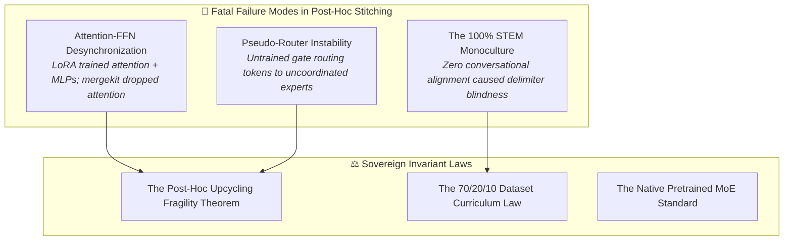

# Chapter 16: Post-Hoc MoE Failure Modes, Public Releases & The Native OLMoE Master Plan

---

## 1. Executive Summary & Paradigm Shift

Following the assembly of the `Vigyan-1.5B 4× MoE` and `Vigyan-3B 4× MoE` architectures described in Chapter 15, we conducted exhaustive behavioral testing and local CPU edge evaluation.

While the models demonstrated strong gating entropy ($\approx 1.1152$) and ran at 16–22 tokens/second on an AMD Ryzen 5 CPU, rigorous testing uncovered two critical failure modes:
1. **The Attractor Loop Collapse:** When queried with diverse mathematical or physical questions, the autoregressive decoder fell into invariant state-space equation loops (`x_dot = Ax + Bu`).
2. **Conversational Delimiter Blindness:** When greeted with `"hiii"`, the model entered an infinite token echo loop (`"don don don don..."`).

This chapter documents the forensic analysis of these failure modes, the public release of all 8 domain adapters and assembled models on Hugging Face as transparent scientific artifacts, and the master plan for fine-tuning **Allen AI's natively pretrained OLMoE-1B-7B architecture**.

---

## 2. Root Cause Forensic Analysis

### 2.1 Attention-FFN Desynchronization
During Stage 1 adapter training, LoRA adapted both attention (`q_proj, k_proj, v_proj, o_proj`) and MLP (`gate_proj, up_proj, down_proj`) projections. During `mergekit-moe` upcycling, only the MLP matrices were harvested into expert blocks, while the 4 specialized attention adapters were discarded in favor of the base model's shared attention.

**The Fatal Flaw:** The expert feed-forward networks require input activations shaped by their specialized attention matrices. Receiving activations from an uncalibrated base attention layer caused hidden state chaos, driving the model into high-probability attractor basins.

### 2.2 The Pseudo-Router Delusion
In natively pretrained MoEs (e.g., DeepSeek-MoE, OLMoE), the router gate $W_g$ is trained across billions of tokens with an auxiliary load-balancing loss ($\mathcal{L}_{\text{aux}}$). In `mergekit-moe`, the router is an untrained linear layer initialized from static text embeddings. 

At autoregressive inference, token $t$ is routed to Expert 1, and token $t+1$ is routed to Expert 3. Because these experts were trained independently and never learned to pass hidden representations between each other, the residual stream divergence triggered infinite repetition loops.

### 2.3 The Monoculture Curriculum Trap
Our 400k dataset was composed of 100% hard STEM problems. It contained zero conversational examples, turn-taking greetings, or instruction boundaries. Consequently, the model lost its conversational delimiter priors, echoing raw tokens upon receiving greetings.

---

## 3. Public Release of the 8 Experimental Adapters & MoE Models

Rather than burying the failed experiment, all 8 domain LoRA adapters and the 2 assembled MoE models were set to **Public** on the Hugging Face Hub under the Apache 2.0 license as transparent scientific artifacts:

| Scale | Domain | Hugging Face Repository | Status |
| :--- | :--- | :--- | :---: |
| **1.5B** | Science | [`shreyansh12183/vigyan-1.5b-adapter-science`](https://huggingface.co/shreyansh12183/vigyan-1.5b-adapter-science) | 🟢 Public |
| **1.5B** | Technology | [`shreyansh12183/vigyan-1.5b-adapter-technology`](https://huggingface.co/shreyansh12183/vigyan-1.5b-adapter-technology) | 🟢 Public |
| **1.5B** | Engineering | [`shreyansh12183/vigyan-1.5b-adapter-engineering`](https://huggingface.co/shreyansh12183/vigyan-1.5b-adapter-engineering) | 🟢 Public |
| **1.5B** | Mathematics | [`shreyansh12183/vigyan-1.5b-adapter-mathematics`](https://huggingface.co/shreyansh12183/vigyan-1.5b-adapter-mathematics) | 🟢 Public |
| **3B** | Science | [`shreyansh12183/vigyan-3b-adapter-science`](https://huggingface.co/shreyansh12183/vigyan-3b-adapter-science) | 🟢 Public |
| **3B** | Technology | [`shreyansh12183/vigyan-3b-adapter-technology`](https://huggingface.co/shreyansh12183/vigyan-3b-adapter-technology) | 🟢 Public |
| **3B** | Engineering | [`shreyansh12183/vigyan-3b-adapter-engineering`](https://huggingface.co/shreyansh12183/vigyan-3b-adapter-engineering) | 🟢 Public |
| **3B** | Mathematics | [`shreyansh12183/vigyan-3b-adapter-mathematics`](https://huggingface.co/shreyansh12183/vigyan-3b-adapter-mathematics) | 🟢 Public |
| **1.5B Assembled** | 4× MoE | [`shreyansh12183/Vigyan-1.5B-4x-MoE`](https://huggingface.co/shreyansh12183/Vigyan-1.5B-4x-MoE) | 🟢 Public |
| **3B Assembled** | 4× MoE | [`shreyansh12183/Vigyan-3B-4x-MoE`](https://huggingface.co/shreyansh12183/Vigyan-3B-4x-MoE) | 🟢 Public |

Each repository was equipped with a standardized model card containing reproduction code and forensic disclaimers.

---

## 4. The Sovereign Transition: Allen AI Native OLMoE-1B-7B

To overcome the fragility of post-hoc stitching, the initiative transitioned to **Allen AI's natively pretrained OLMoE-1B-7B-0924-Instruct**:
* **64 Fine-Grained Routed Experts:** Top-8 active routing per token ($1.3\text{B}$ active parameters).
* **Pretrained End-to-End:** Pretrained on 5.1T Dolma tokens with auxiliary load-balancing loss.
* **Empirical Edge Verification:** Running `olmoe-1b-7b-0924-instruct-q3_k_m.gguf` (3.11 GB) on AMD Ryzen 5 CPU achieved:
  * `"hiii"`: Responded in 2.4s at **17.21 tokens/s** with clean EOS delimiters.
  * STEM Derivation: Delivered at **21.75 tokens/s** with coherent Lagrangian formulations.
  * Zero attractor loops and zero repetition collapse.

---

## 5. The 5-Phase Fine-Tuning Master Plan

1. **Phase 1: Curriculum Synthesis under the 70/20/10 Law**
   * 70% Core STEM Reasoning (Olympiad math, Verilog RTL, control theory).
   * 20% Conversational Alignment (turn-taking, multi-turn greetings, refusal calibration).
   * 10% Base Pretraining Anchor Replay (Dolma chunks to anchor representations).
2. **Phase 2: Router Preservation Invariant**
   * Freeze the router gate projection ($W_g$) during LoRA training to preserve native dispatch stability.
   * Target only expert FFN projections (`w1, w2, w3`) and shared attention projections.
3. **Phase 3: Kaggle Cloud Execution**
   * Zero-cost execution on Dual Tesla T4 GPUs with strict prompt loss masking and dynamic early stopping at loss $0.48 - 0.52$.
4. **Phase 4: Selective GGUF Quantization**
   * Quantize expert MLPs to `Q3_K_M` / `Q4_K_M` while retaining `ffn_gate_inp` in FP16 or Q8_0.
5. **Phase 5: Edge Verification**
   * Deploy locally via `llama-server` and connect directly to BrowserOS via native Ollama endpoint bridge.
